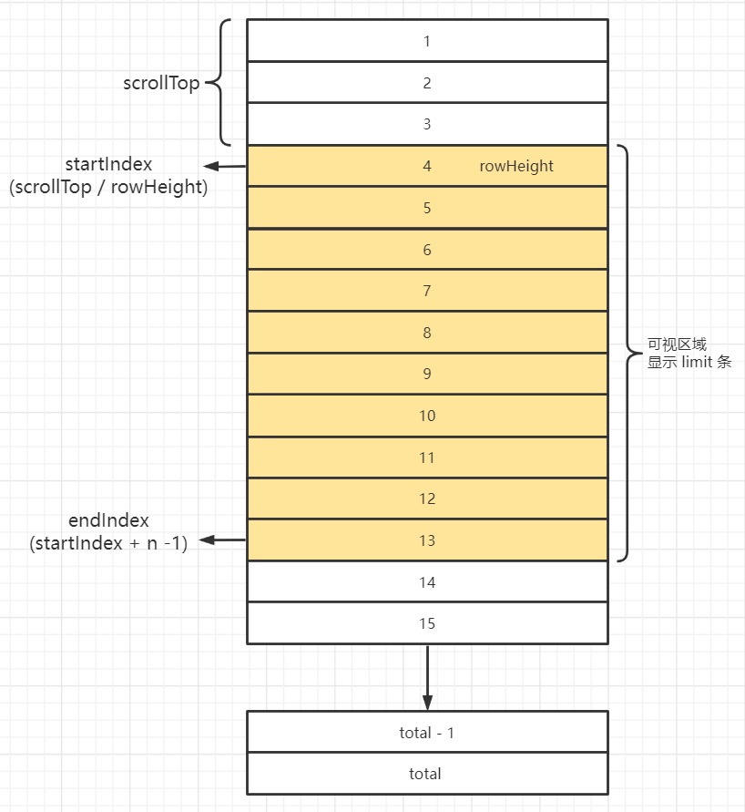
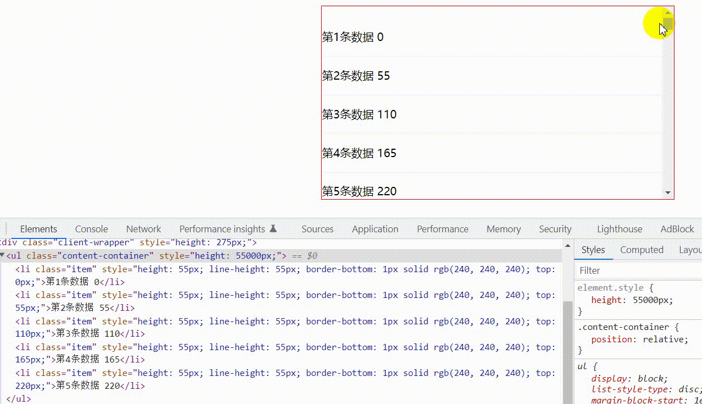

# 浅析虚拟列表实现

## 结构图

结构如下：



属性说明

| 属性       | 说明                 | 计算                                                         |
| ---------- | -------------------- | ------------------------------------------------------------ |
| rowHeight  | 行高                 | 支持用户自定义设置                                           |
| limit      | 可视区域展示多少行   | 支持用户自定义设置                                           |
| scrollTop  | 滑动距离             | 滚动事件                                                     |
| startIndex | 可视区域第一行的下标 | scrollTop / rowHeight                                        |
| endIndex   | 可视区域最后一行下标 | startTop + limit  - 1(截取数据会使用slice， 下文中就不 - 1 了) |
| total      | 数据总条数           | /                                                            |

## DOM结构

1. 外层用户可视区域 client-wrapper
2. 里层数据容器 content-container
3. 容器内的每一条数据 item （根据需要展示的数据动态生成的）
4. **`注意`**: item 需要**相对 数据容器 进行绝对定位。确保数据容器在滚动的时候， 里面的 item 能一直展示在可视区域内。**

```vue
<!-- 外层可视区域 client-wrapper -->
 <div
      class="client-wrapper"
      :style="`height: ${ limit * rowHeight }px`"
      @scroll="onScroll"
>
     <!-- 里层数据容器 content-container -->
     <ul class="content-container" :style="`height: ${ contentHeight }px`">
         <!-- 每一项数据 -->
          <li
            class="item"
            v-for="item in contentData"
            :key="item.index"
            :style="`
              height: ${ rowHeight }px;
              line-height: ${rowHeight}px;
              border-bottom: 1px solid #f0f0f0;
              top: ${ item.index * rowHeight }px;
            `"
          >
            {{ item.title }} {{ item.index * rowHeight }}
          </li>
     </ul>
</div>

<style>
    .content-container {
        position: relative;
    }
    .item {
        display: block;
        position: absolute;
        left: 0;
        right: 0;
    }
</style>
```

## 主要原理

- **step1**

  1. 可视区域固定高度，给定`overflow-y: scroll` 让里面的数据容器可以滑动;

  2. 数据容器高度 = 数据总数 total * 行高 rowHeight;

- **`step2`**

  根据滚动距离 scrollTop 和 行高 rowHeight 可以计算出**当前可视区域第一行数据在整个数据中的下标**。

  ```js
  const currentIndex = Math.floor(e.target.scrollTop / rowHeight.value)
  ```

- **`step3`**

  根据可视区域的起始下标，动态的从整个数据中截取当前起始范围内的数据，进行渲染

  ```js
  // 可视区域数据（根据startIndex, endIndex动态截取）
  const contentData = computed(() => data.value.slice(startIndex.value, endIndex.value))
  
  // 滚动事件
  const onScroll = e => {
      const currentIndex = Math.floor(e.target.scrollTop / rowHeight.value)
      if (originStartIndex.value !== currentIndex) {
          originStartIndex.value = currentIndex
          startIndex.value = currentIndex
          endIndex.value = Math.min(currentIndex + limit.value, total.value - 1)
      }
  }
  ```




## 白屏优化

如果遇到滑动过快出现空白区域的问题，可以添加缓冲

```js
const bufferSize = 20 // 用于缓冲（防止滚动过快，出现白屏）
const startIndex = computed(() => Math.max(originStartIndex.value - bufferSize, 0))
const endIndex = computed(() => Math.min(startIndex.value + limit.value + bufferSize, total.value))
```

## 总结

1. 结构上：数据item 要相对里层的 数据容器 绝对定位，通过动态设置top的值( index * rowheight ) 让item始终展示在可视区域内；
2. 可视区域起始下标 = Math.floor(scrollTop / rowHeight)
3. 根据起始下标从数据中动态截取部分数据展示
4. 白屏优化：起始范围前后多加一点

## 参考资料

https://juejin.cn/post/6877507011769008135

https://blog.csdn.net/YMX2020/article/details/120562140

